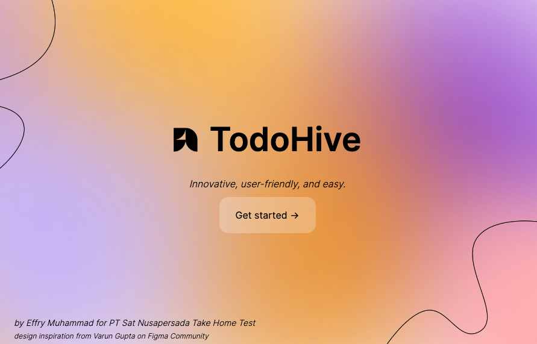

# TodoHive App



This is a simple todo app that uses the JsonPlaceholder API to fetch and display todos. It is built with Next.js and TypeScript.
<br>
This project was created as a result of the take home test assignment for PT Sat Nusapersada recruitment

## Key Features
- CRUD Feature using JsonPlaceholder (mock API)
- User selection feature
- Using local storage to store user data seamlessly
- State Management using Redux Toolkit, optimizing user experience
- Unit testing using Jest and React Testing Library
- Beautiful UI
- Typesafe using TypeScript

## Getting Started

First, run the development server:

```bash
npm install
# or
yarn install
```

then,

```bash
npm run dev
# or
yarn dev
# or
pnpm dev
# or
bun dev
```

Open [http://localhost:3000](http://localhost:3000) with your browser to see the result.

You can start editing the page by modifying `app/page.tsx`. The page auto-updates as you edit the file.

This project uses [`next/font`](https://nextjs.org/docs/basic-features/font-optimization) to automatically optimize and load Inter, a custom Google Font.

## Developer Notes
Thank you for reviewing my code. I hope you satisfied with my work. I'm looking forward to hearing from you soon.